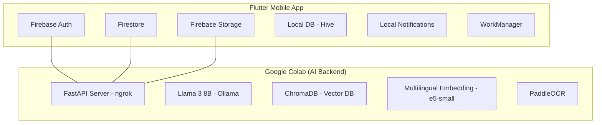

# MediMetra - Digital Health Record Management for Migrant Workers

## 1. Overview
**MediMetra** is a mobile‑first platform designed for migrant workers to manage their health records, receive AI‑powered insights, set medicine reminders, and securely share reports with doctors via time‑limited QR codes. The entire AI backend (summarization and conversational assistant) runs offline using open‑source LLMs on Google Colab, ensuring data privacy and no recurring API costs.

- **Target Users:** Migrant workers in Kerala (and eventually across India).
- **Alignment:** SDG 3 (Good Health), SDG 8 (Decent Work), SDG 10 (Reduced Inequalities).

## 2. Core Features

| Feature | Description |
| :--- | :--- |
| **Report Collection** | Upload medical reports (PDF/Image) from gallery or camera. |
| **AI Summarizer** | Extracts structured info (patient, doctor, medicines, etc.) from uploaded reports. |
| **AI Assistant (RAG)** | Answers questions about user’s health records and general medical knowledge using an offline LLM. |
| **Medicine Reminder** | Schedules local notifications with dosing instructions (e.g., “Take 200 mg with food”). |
| **QR Code Sharing** | Generates a time‑limited QR code that doctors can scan to view the user’s summary and reports. |
| **Future: Insurance Claim** | Submit claims directly from the app by selecting relevant reports. |

## 3. System Architecture

### 3.1 High‑Level Components

### 3.2 Data Flow
1. **User uploads report:** Flutter app uploads file to Firebase Storage → Cloud Function triggers the Python summarizer (via HTTP) → Summarizer runs OCR → extracts structured data → stores summary in Firestore → generates embeddings → stores in ChromaDB.
2. **User asks question in AI Assistant:** App sends query to Colab `/chat` endpoint → Backend retrieves relevant chunks from ChromaDB (user’s data + general knowledge) → prompts Llama → returns answer.
3. **Medicine reminder creation:** App stores in Firestore + local Hive → schedules local notification using `flutter_local_notifications` with daily repeat.
4. **QR code sharing:** App calls Cloud Function to generate token → stores in Firestore → creates QR code → doctor scans → web view validates token and displays summary.

## 4. Tech Stack

| Layer | Technology |
| :--- | :--- |
| **Mobile App** | Flutter (Dart) |
| **Backend** | Firebase (Auth, Firestore, Storage, Functions) |
| **AI Backend** | Google Colab (with GPU T4), FastAPI, ngrok |
| **LLM** | Llama 3 8B Instruct (4‑bit quantized via Ollama) |
| **Vector DB** | ChromaDB (local, persistent) |
| **Embeddings** | intfloat/multilingual-e5-small |
| **OCR** | PaddleOCR (Hindi & English support) |
| **Local Notifications** | flutter_local_notifications + workmanager |
| **Local Storage** | Hive (offline reminders & reports metadata) |

## 5. Security & Deployment

### 5.1 Environment Variables
MediMetra uses environment variables for secure credential management. 
1. **Locate** the `backend/.env.example` file.
2. **Copy** it to `backend/.env`.
3. **Fill in** your `FIREBASE_CREDENTIALS_PATH` or `FIREBASE_SERVICE_ACCOUNT_JSON`.
4. **Add** your `GEMINI_API_KEY`.

> [!IMPORTANT]
> Never commit `.env` or `serviceAccountKey.json` to version control. They are explicitly ignored in our `.gitignore`.

## 6. Detailed Implementation Steps

### 6.1 Google Colab Setup (AI Backend)
1. **Setup:** Create a new Colab notebook with GPU (T4). Install dependencies via `!pip install fastapi uvicorn pyngrok nest-asyncio paddlepaddle paddleocr chromadb sentence-transformers ollama`.
2. **Ollama:** Install and serve Llama 3 using the Ollama installation script.
3. **ChromaDB:** Initialize `PersistentClient` for local vector storage.
4. **FastAPI Endpoints:**
    - `/summarize`: Downloads file, runs OCR, extracts structured data via Llama, generates embeddings, and stores in ChromaDB.
    - `/chat`: Implements RAG to answer queries based on user records.
5. **Exposure:** Use `ngrok` to expose the FastAPI server to the internet.

### 6.2 Firebase Setup
1. **Auth:** Enable Phone and Email/Password.
2. **Firestore Collections:** `users`, `reports`, `medicines`, `qrShares`.
3. **Functions:** Implement logic for upload triggers and token generation.

### 6.3 Flutter App Implementation
1. **Hive:** Store medicines and metadata locally for offline access.
2. **Notifications:** Use `flutter_local_notifications` for scheduled medicine alerts.
3. **Chat UI:** Build a conversational interface connecting to the Colab endpoint via ngrok.
4. **QR Sharing:** Implement token generation and dynamic QR code display.

## 7. Data Models (Firestore)

### Users
- `userId`, `phone`, `name`, `language`, `createdAt`.

### Reports
- `reportId`, `userId`, `fileName`, `fileUrl`, `uploadDate`.
- `summary`: Object containing patient info, doctor info, diagnosis, and medicines.

### Medicines
- `medicineId`, `userId`, `reportId`, `name`, `dosage`, `timings`, `active`.

### QR Shares
- `shareId`: Unique identifier for the share.
- `userId`: Reference to the user who created it.
- `reportIds`: Array of strings (references to included reports).
- `token`: Unique access token.
- `expiresAt`: Timestamp of expiration.
- `maxViews`: (Optional) Maximum allowed views.
- `viewCount`: Number of times the link has been accessed.
- `createdAt`: Timestamp of creation.

## 8. User Flows

### 8.1 Onboarding
1. User enters phone number → receives OTP → verifies.
2. User enters name and selects preferred language (English/Hindi).

### 8.2 Uploading a Report
1. Tap "Add Report" → choose file (PDF/Image).
2. Code handles upload to Firebase Storage → triggers AI summarization.
3. User sees "Processing..." → summary appears after extraction.
4. Option to add medicine reminders directly from detected data.

### 8.3 AI Assistant
1. Tap "Ask AI" → enters chat interface.
2. Ask questions like: *"What was my last blood test result?"* or *"मुझे कब दवा लेनी है?"*
3. Backend retrieves context from ChromaDB and returns an AI-generated answer.

### 8.4 Medicine Reminder
1. User adds medicine (manual or AI-extracted).
2. Notification fires at the scheduled time: *"Take Ferrous Sulfate – 200 mg – with breakfast"*.
3. User marks as "taken" to track compliance.

### 8.5 QR Share
1. User selects reports → sets expiry → taps "Generate QR".
2. Doctor scans QR → view-only access to specific summaries and reports.

## 9. Challenges & Mitigations

| Challenge | Mitigation |
| :--- | :--- |
| **LLM Memory** | Use 4‑bit quantization of Llama 3 8B or fallback to Phi‑3‑mini. |
| **Hindi Support** | System prompting for multilingual responses; test with Aya‑23 if required. |
| **OCR Accuracy** | Utilize PaddleOCR for high accuracy; allow manual summary correction. |
| **Device Restarts** | Use `workmanager` to re-schedule alerts on boot. |
| **Colab Timeout** | Use Colab Pro or fallback to Hugging Face Spaces/Replit. |

## 10. Future Scope
- **Insurance Claim Integration**: Direct API submission to insurers.
- **Multi-language Expansion**: Support for Malayalam, Tamil, etc.
- **Wearable Integration**: Sync with smartwatches for vital signs.
- **Telemedicine**: In-app video consultations.
- **Health Trends**: AI-driven analysis of metrics over time.

## 11. Conclusion
**MediMetra** provides a privacy‑focused, zero-recurring-cost health solution for migrant workers. By decentralizing the AI backend and leveraging mobile-first design, it addresses critical health inequalities with a scalable, practical architecture.

## 12. Appendix: Sample API Endpoints

### `/summarize` (POST)
- **Input**: `{ "fileUrl": "...", "userId": "..." }`
- **Process**: Download → OCR → Extraction → Firestore Storage.

### `/chat` (POST)
- **Input**: `{ "userId": "...", "query": "..." }`
- **Process**: Retrieval → RAG Prompt → Ollama Call → Response.

### `/add_reminder` (Cloud Function)
- **Input**: `{ "userId": "...", "medicine": {...} }`
- **Process**: Store in Firestore → Trigger local app scheduling.
